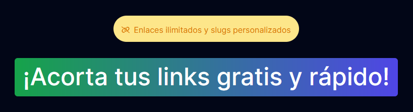

<div align="center">

<a href="slug.vercel.app">

</a>

<p></p>

<a href="https://prl-phi.vercel.app/">🚀 Short link</a>
<span>&nbsp;&nbsp;•&nbsp;&nbsp;</span>
<a href="https://www.linkedin.com/in/luisprendasdev/">💼 LinkedIn</a>

[](https://nodejs.org/about/releases)

</div>

## 👨‍🚀 Getting Started

> 🚧 You will need [Nodejs +16 (LTS recommended)](https://nodejs.org/en/) installed.

1. Fork this project:

- [Click here](https://github.com/pheralb/slug/fork).

2. Clone the repository:

```bash
git clone git@github.com:YOU_USER/slug.git
```

3. Install dependencies:

```bash
npm install
# or
pnpm install
# or
yarn install
```

4. Create a **.env** file with the following content:

```bash
# Planetscale DB URLs:
PROYECT_URL_SUPABASE:
ANON_PUBLIC_KEY_SUPABASE:

# Link to your page:
PAGE_LINK:
```

5. Ready 🥳, now run:

```bash
# Run the project:
npm run dev
```

## 🎉 Deploy on Vercel

- ✅ [https://prl-phi.vercel.app/](https://prl-phi.vercel.app/).
